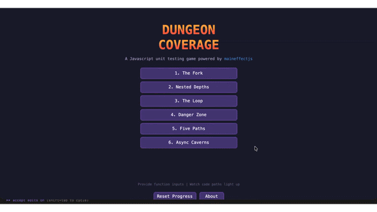

# Dungeon Coverage

A Javascript unit testing game powered by [maineffectjs](https://github.com/arvindrajnaidu/maineffect).

**[Play it now](https://arvindrajnaidu.github.io/dungeon-coverage/)**



## How it works

Every JavaScript function becomes a dungeon. Branches are forking paths. Loops are winding corridors. And the gems scattered throughout? Those are your code coverage.

Your mission: achieve 100% coverage to complete each level.

1. **Forge your weapons** - Create test inputs: numbers, strings, arrays, or stub functions
2. **Equip your hero** - Drag weapons into the function's parameter slots
3. **Run the test** - Watch your hero walk through the exact code path your inputs execute
4. **Collect gems** - Each covered statement lights up as you pass through
5. **Save as test** - Decide which runs to keep as test cases

## Levels

1. **The Fork** - Simple if/else branch
2. **Nested Depths** - Nested conditions
3. **The Loop** - For loop iteration
4. **Danger Zone** - Try/catch error handling
5. **Five Paths** - Switch statement
6. **Async Caverns** - Async functions with stubs

## Getting started

```bash
npm install
npm run dev
```

## Credits

- **Dungeon Tileset II v1.7** by [0x72](https://0x72.itch.io)
- **Retro Sound Effects Collection** by Juhani Junkala (CC0)
- Built with [PIXI.js](https://pixijs.com) and [Howler.js](https://howlerjs.com)
- Powered by [maineffectjs](https://github.com/arvindrajnaidu/maineffect)
